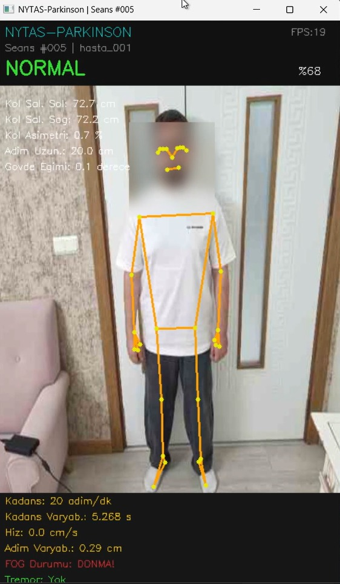
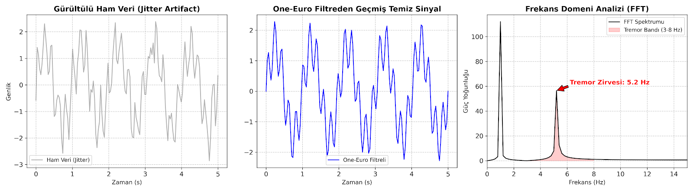
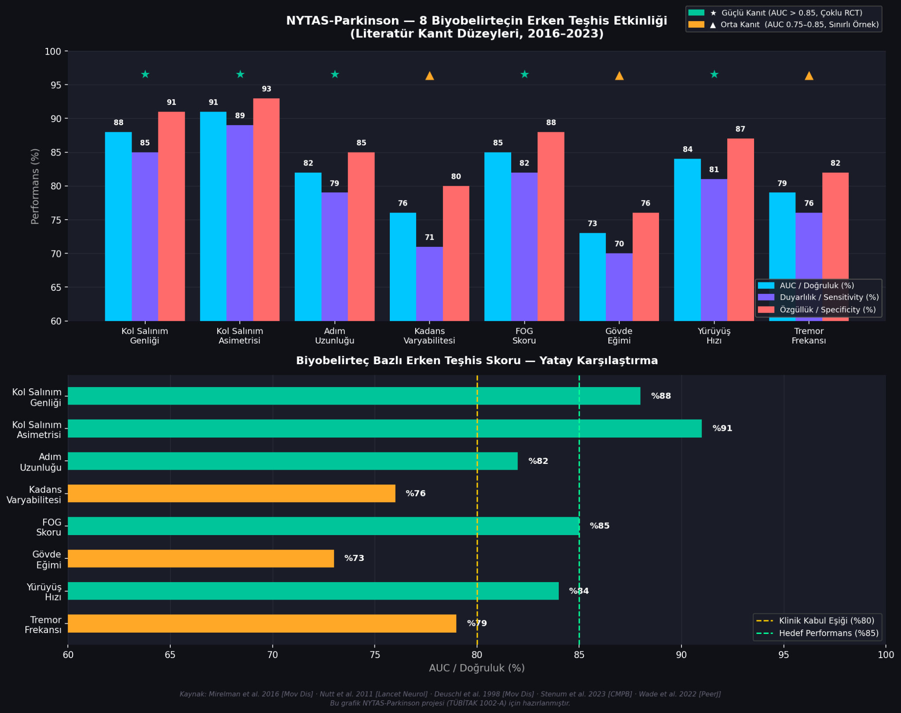

# NYTAS-PARKINSON — Parkinson Hastalığı Odaklı Yürüyüş Analiz Sistemi

**TÜBİTAK 1002 Hızlı Destek Programı** kapsamında geliştirilen bu proje, yürüyüş ve postür verilerinden Parkinson hastalığı dijital biyobelirteçlerini ölçer ve makine öğrenmesi modelleri ile değerlendirir.

> **Sürüm: v1.3 — Klinik Hassasiyet İyileştirmesi** (Eylül 2026)

---

## 📋 v1.3 Güncelleme Notları

| Değişiklik | Açıklama |
|------------|----------|
| **3D Gövde Eğimi** | Gövde eğimi artık MediaPipe world_landmarks 3D koordinatlarıyla sagittal düzlemde (öne eğilme) ölçülüyor. Eski 2D formül sadece yana yatmayı algılıyordu. |
| **Z-Ekseni Yürüyüş Hızı** | Yürüyüş hızı artık Z-derinlik ekseni üzerinden hesaplanıyor. Kameraya doğru yürürken artık doğru hız ölçülüyor (eski: ~0 cm/s). |
| **Klinik Eşik Kalibrasyonu** | Sentetik eğitim verileri erken-orta evre Parkinson (H&Y 1-2) klinik bulgularına göre güncellendi. Eski eşikler sadece ileri evre hastaları tespit ediyordu. |
| **Hibrit Karar Motoru** | ML modeline ek olarak 8 parametreli klinik kural motoru eklendi. 3+ parametre klinik eşiği aşarsa risk bildirilir. |
| **HUD Risk Renklendirme** | Canlı ekrandaki parametreler klinik eşik değerlerine göre kırmızı/yeşil renklendiriliyor. |
| **ML Tutarlılık** | Tüm ML girdi değerleri artık temporal ortalamalara (sliding window) dayalı — anlık/temporal karışıklık giderildi. |
| **Klinik Etiketleme (Ground Truth)** | Hekim tarafından doğrulanmış ön tanı etiketlemesi (`0: Sağlıklı`, `1: Parkinson`) eklendi. |
| **Kararlı Seans Havuzu** | Binlerce gürültülü video karesi yerine seans başına 1 satırlık stabil medikal profil (`seanslar_ozet.csv`) oluşturuluyor. |
| **Otomatik Medikal Raporlama** | Test bitiminde tek tıkla yazdırılabilir A4 medikal HTML/PDF raporu ve biyobelirteç radar analizi üretiliyor. |
| **Video Dosyasından Analiz** | Kayıtlı hasta yürüyüş videolarından (.mp4, .avi, .mov, .mkv) doğrudan BlazePose analizi ve anında klinik rapor üretimi eklendi. |
| **İki Fazlı Klinik Seans Akışı** | Hekim ve hasta için tam yönergeli test motoru: Faz 1 (İstirahat Tremor, 45s) ➔ Faz 2 (Yürüyüş Analizi, 60s), otomatik geçiş ve seans sonu rapor. |
| **Duyarlı & Kaydırılabilir Arayüz** | Otomatik tam ekran (maximize) başlatma, fare tekerleği destekli dikey kaydırma (Canvas Scrollbar) ve 2 sütunlu kompakt araç kartları eklendi. |

---

## 🖥️ Çalışır Prototip ve Canlı Analiz Ekranı

Aşağıdaki görselde, TÜBİTAK 1002-A proje başvuru formunda da sunulan **NYTAS-Parkinson** çalışan prototipinin gerçek zamanlı test arayüzü yer almaktadır:

<p align="center">
  
  <br>
  <em>Şekil 1: NYTAS-Parkinson Gerçek Zamanlı Analiz & Karar Destek Ekranı (TÜBİTAK 1002-A Başvuru Formu Şekil 5)</em>
</p>

* **İskelet Modeli (Skeletal Overlay):** MediaPipe Pose Landmarker ile 33 anatomik eklem noktası 30 FPS hızında takip edilir.
* **Anlık Biyobelirteç Paneli (Sol):** Kol salınımı (sol/sağ cm), salınım asimetrisi (%) ve adım uzunluğu milisaniyelik hesaplanır.
* **Temporal Analiz Paneli (Alt):** FFT tabanlı el tremoru frekansı (Hz), Donma Fenomeni (FOG) ve yürüyüş hızı gösterilir.
* **KVKK & Gizlilik Katmanı:** Gerçek zamanlı dinamik Gaussian Blur ile hastanın yüzü anonimleştirilir.
* **Hibrit Karar Destek (Üst):** Makine öğrenmesi modeli ve klinik kural motoru ile anlık teşhis ve güven skoru sunulur.

---

## 📈 Sinyal İşleme ve FFT Tremor Analiz Hattı

Kameradan gelen optik gürültü (jitter artifact), **One-Euro Adaptif Filtresi** ile el titremesi frekansları silinmeden temizlenir; ardından FFT spektrumu ile 3-8 Hz bandındaki Parkinson tremoru tespit edilir:

<p align="center">
  
  <br>
  <em>Şekil 2: Gürültülü Ham Veri, One-Euro Filtrelenmiş Temiz Sinyal ve 5.2 Hz Tremor FFT Spektrumu (Başvuru Formu Şekil 4)</em>
</p>

---

## 📁 Proje Klasör Mimarisi (Türkçe Düzen)

```
PARKİNSON-NYTAS/
│
├── 1_UYGULAMAYI_BASLAT.bat      # Çift tıklayarak sistemi başlatan ana kısayol
├── 00_PROJE_VE_KLASOR_REHBERI.txt# Klasör ve proje Türkçe açıklama rehberi
│
├── ayarlar/                     # Konfigürasyon ve Yol Tanımları (Eski: config)
│   └── settings.py              # Kök dizin, model ve veri yolları ayarları
│
├── modeller/                    # Modeller ve Landmark Binary Dosyaları (Eski: models)
│   ├── pose_landmarker.task     # MediaPipe Pose Landmarker (BlazePose 33 Landmark)
│   └── parkinson_model.pkl      # Eğitilmiş Random Forest / ML Modeli
│
├── veriler/                     # Veri Setleri ve Seans Kayıtları (Eski: data)
│   ├── raw/                     # Referans / Eğitim Veri Setleri (.csv)
│   │   ├── dataset_normal_parkinson.csv
│   │   └── dataset_parkinson_parkinson.csv
│   └── processed/               # Canlı Seans Kayıtları & Master CSV
│       └── nytas_parkinson_veri/
│           ├── parkinson_master.csv
│           ├── seanslar_ozet.csv # 1 Satırlık Kararlı Seans Medikal Özetleri
│           └── seans_001 ... seans_006/
│
├── kaynak_kodlar/               # Kaynak Kodlar (Eski: src)
│   ├── nytas_parkinson.py       # Canlı Yürüyüş Analizi & GUI / Kamera Modülü
│   ├── iki_fazli_seans.py       # İki Fazlı (İstirahat Tremor ➔ Yürüyüş) Test Motoru
│   ├── model_egitim_parkinson.py# ML Modeli Eğitim ve Değerlendirme Betiği
│   └── rapor_olusturucu.py      # Otomatik Medikal HTML/PDF Klinik Rapor Motoru
│
├── dokumanlar/                  # Proje Dokümantasyonu & Başvuru Formları (Eski: docs)
│   ├── 1002_a_basvuru_formu_nystas-parkinson_2026_v3.doc
│   ├── basvuru_formu.docx
│   ├── gorseller/               # Proje ve Prototip Görsel Varlıkları
│   └── YOL_HARITASI_VE_PROTOTIP_PLANI.md # Gelecek Yol Haritası ve Prototip Planı
│
├── calistirma_betikleri/        # Çalıştırma, Kurulum ve Kısayol Betikleri (Eski: scripts)
│   ├── setup_env.bat            # Windows sanal ortam kurulumu
│   ├── setup_env.sh             # Linux/macOS sanal ortam kurulumu
│   ├── run_nytas.bat            # Canlı analizi doğrudan başlatma kısayolu
│   └── train_model.bat          # Model eğitimini başlatma kısayolu
│
├── main.py                      # Ana Yönetim ve Kontrol Paneli (Masaüstü Arayüzü)
├── requirements.txt             # Python Bağımlılık Listesi
├── .env.example                 # Çevre değişkenleri ve kamera konfigürasyon örneği
└── README.md                    # Kullanım kılavuzu ve proje mimarisi
```

---

## 🚀 Hızlı Başlangıç

### 1. Kolay Başlatma (Tavsiye Edilen)

Kök dizindeki **`1_UYGULAMAYI_BASLAT.bat`** dosyasına çift tıklayarak modern grafik yönetim panelini doğrudan başlatabilirsiniz.

### 2. İnteraktif Masaüstü Paneli

```bash
python main.py
```

### 3. Kısayol Betikleri ile Çalıştırma

* **Canlı Analiz Başlatma:** `calistirma_betikleri\run_nytas.bat`
* **Model Eğitimi Başlatma:** `calistirma_betikleri\train_model.bat`


---

## 🔬 Dijital Biyobelirteçler (8 Odak Parametre)

1. **Kol Salınım Genliği** (Arm Swing Amplitude)
2. **Kol Salınım Asimetrisi** (Arm Swing Asymmetry)
3. **Adım Uzunluğu** (Stride Length)
4. **Kadans / Düzensizlik** (Cadence Variability)
5. **Donma Skoru** (Freezing of Gait - FOG)
6. **Gövde Öne Eğimi** (Trunk Flexion / Camptocormia)
7. **Yürüyüş Hızı** (Gait Velocity)
8. **El Tremor Frekansı** (Hand Tremor Frequency via FFT)

<p align="center">
  
  <br>
  <em>Şekil 3: NYTAS-Parkinson 8 Biyobelirtecin Erken Teşhis Etkinliği ve Literatür Kanıt Düzeyleri (Başvuru Formu Şekil 2)</em>
</p>
